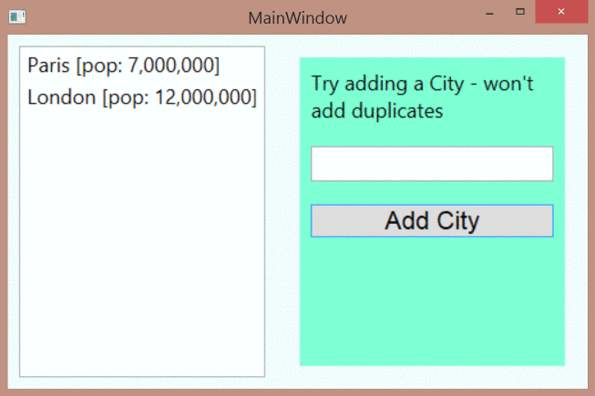

##Using static collections

The code is thoroughly commented so look to those inline explanations.
The general purpose here is to allow the user to add new **Cities** to the collection. Only those **Cities** not already in the collection are added.
How the program decides whether the **City** is already in the collection is important here.

In an earlier version, we used **String** for holding each City (i.e. just the name of the **City**) which meant we could use the **.Contains()** member of the **List&lt;T&gt;** class to see if the **City** were present already.
However, this later version which uses a proper class, **City**, to hold both the name and population means **Contains()** won't work - see the code for details.

There are several solutions which are explored in the code.
